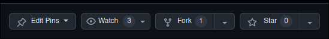

# 🤝 Contributing Guide

Thank you for considering contributing to our project! This guide will help you understand the contribution workflow and best practices to follow.

## Forking the Repository

To start contributing, first fork the repository:

1. Visit the project repository on GitHub.
2. Click the **Fork** button in the top-right corner of the page. Refer to the example screenshot below:

    

This will create a copy of the repository under your GitHub account.

## Cloning the Repository

Once you've forked the repository, clone it to your local machine:

```bash
# Replace 'username' with your GitHub username
git clone git@github.com:username/tello_suite.git
```

This will download the repository to your local system.

## Setting Up a New Branch

Before starting work on a new feature or bug fix, create a new branch to keep your changes organized. Use a descriptive branch name based on the work you’re doing. For example, if you’re adding a new plugin for interacting with a large language model (LLM), you might use a branch name like `feat/llm_plugin`.

### Workflow Example

Here’s an example of a typical workflow:

```bash
cd tello_suite

git checkout -b feat/llm_plugin # Create and switch to a new branch

# Make changes to your code

git add <files> # Stage your changes
git commit -m "A short and descriptive commit message" # Commit your changes

git push -u origin feat/llm_plugin # Push the branch to your fork and set up tracking
```

### Tips for Commit Messages

- Use clear and concise messages.
- Begin with a verb in the imperative mood (e.g., "Add," "Fix," "Update").
- Keep the message short but descriptive.

## Submitting Your Changes

After completing your changes and pushing them to your branch, create a pull request (PR):

1. Go to your forked repository on GitHub.
2. Navigate to the branch you worked on.
3. Click the **Pull Request** button.
4. Fill out the PR template (if provided) and add a clear description of your changes.
5. Submit the PR for review.

Your PR will be reviewed by maintainers, and you may be asked to make some changes before it is merged.

---

Thank you for contributing! Your efforts make this project better for everyone.
