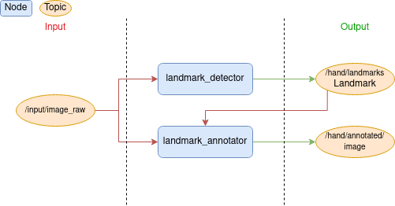

# Hand Gestures Plugin

This plugin aims to detect hand landmarks and interpret the landmarks to gestures.
These gestures can then be used to control a robot movement for instance.

## 🚀 Standalone Usage

!!! note

    Each command needs to be executed in 2 different terminals and you must source the `install/setup.bash` which was created in the section above.

1. Launch the detector node in **standalone** mode

```sh
 ros2 run hand_gestures landmark_detector_node --ros-args -p standalone:=true
```

2. Launch the annotator node in **standalone** mode

```sh
 ros2 run hand_gestures landmark_annotator_node --ros-args -p standalone:=true
```

## 🏗️ Architecture

<figure markdown="1">
{align=center}
</figure>

This plugin is composed of 2 main nodes: `landmark_detector_node` and `landmark_annotator_node`. Landmark detector node is responsible for detecting hand landmarks in images and publishing both the landmarks and the recognized gestures.
The landmark annotator node is responsible for drawing the detected landmarks on the image and publishing the annotated image.

## 🤖 ROS Related

### 📥 Subscribed Topics

#### Landmark Detector Node

| Topic Name          | Message Type                                                                             | Description                     |
| ------------------- | ---------------------------------------------------------------------------------------- | ------------------------------- |
| `/camera/image_raw` | [sensor_msgs/Image](http://docs.ros.org/en/melodic/api/sensor_msgs/html/msg/Image.html)) | Input image for hand detection. |

#### Landmark Annotator Node

| Topic Name          | Message Type                                                                                                                   | Description                         |
| ------------------- | ------------------------------------------------------------------------------------------------------------------------------ | ----------------------------------- |
| `/camera/image_raw` | [sensor_msgs/Image](http://docs.ros.org/en/melodic/api/sensor_msgs/html/msg/Image.html)                                        | Input image use for hand detection. |
| `/hand/landmarks`   | [hand_gestures_msgs/Landmakrs](https://github.com/snt-arg/hand_gestures_plugin/blob/main/hand_gestures_msgs/msg/Landmarks.msg) | Landmarks detected.                 |

### 📤 Published Topics

#### Landmark Detector Node

| Topic Name        | Message Type                                                                                                                    | Description                                |
| ----------------- | ------------------------------------------------------------------------------------------------------------------------------- | ------------------------------------------ |
| `/hand/landmarks` | [hand_gestures_msgs/Landmakrs](https://github.com/snt-arg/hand_gestures_plugin/blob/main/hand_gestures_msgs/msg/Landmarks.msg)) | Output landmarks topic for detected hands. |

#### Landmark Annotator Node

| Topic Name              | Message Type                                                                             | Description                                        |
| ----------------------- | ---------------------------------------------------------------------------------------- | -------------------------------------------------- |
| `/hand/annotated/image` | [sensor_msgs/Image](http://docs.ros.org/en/melodic/api/sensor_msgs/html/msg/Image.html)) | Annotated image with landmarks for detected hands. |

### ⚙️ Parameters

#### Landmark Detector Node

| Parameter Name             | Description                          | Default             |
| -------------------------- | ------------------------------------ | ------------------- |
| `img_input_topic`          | Input image topic name.              | `/camera/image_raw` |
| `landmarks_topic`          | Detected landmarks on image.         | `hand/landmarks`    |
| `num_hands`                | Maximum number of hands to detect.   | 2                   |
| `min_detection_confidence` | Minimum confidence to detect a hand. | 0.5                 |
| `min_tracking_confidence`  | Minimum confidence to track a hand.  | 0.5                 |

#### Landmark Annotator Node

| Parameter Name        | Description                                | Default             |
| --------------------- | ------------------------------------------ | ------------------- |
| `img_input_topic`     | Input image topic name.                    | `/camera/image_raw` |
| `annotated_img_topic` | Annotated image with landmarks topic name. | `/camera/image_raw` |
| `landmarks_topic`     | Detected landmarks on image.               | `hand/landmarks`    |
